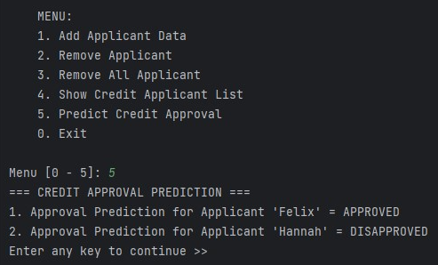
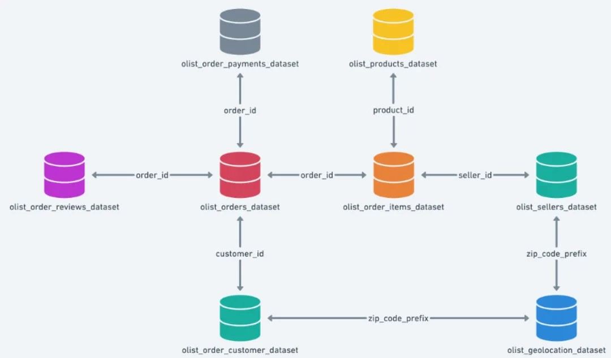
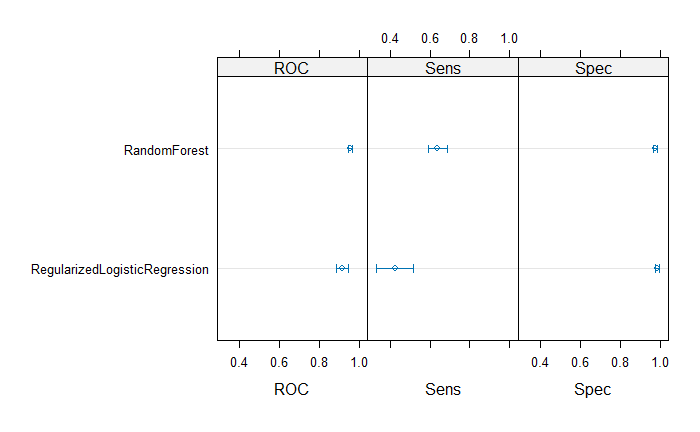
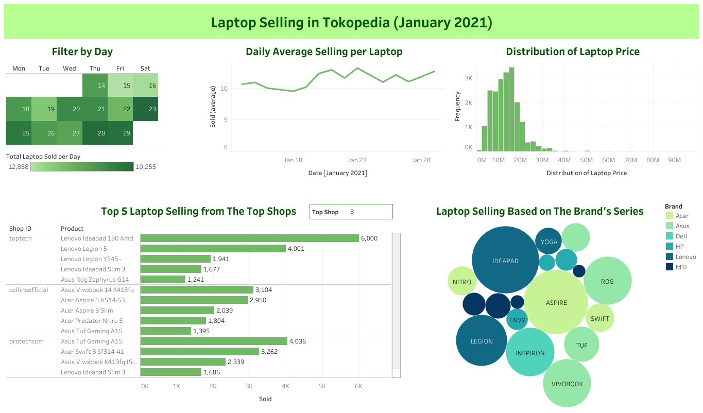

# Portfolio

[novitaaryanti25@gmail.com](mailto:novitaaryanti25@gmail.com) | [LinkedIn](https://www.linkedin.com/in/novita-aryanti/) | [Medium](https://medium.com/@novitaaryanti25) | [CV](https://drive.google.com/file/d/1QTR3A2OvnO4gJ--tdmr1zXsBP2hLJMeX/view)

Access Portfolio Website: https://novitaaryanti.github.io/portfolio/

## Objective and Interest
A fourth-year Computer Science undergraduate student at Bina Nusantara University who is passionate about artificial intelligence, machine learning, statistics, and data analytics. Has a high willingness to learn and is eager to keep skills up to date in a collaborative environment.

## Projects
### [Credit Approval Prediction Program](https://github.com/novitaaryanti/credit_approval_prediction_project#readme)

> **Highlighted Skills**:
> Python, Pandas, scikit-learn, Machine Learning, Logistic Regression, Random Forest, XGBoost, Matplotlib, Data Structure, Object-Oriented Programming

Building a simple program combining machine learning model prediction and Object-Oriented Programming (OOP) concepts in Python which covers the minimum requirements of a credit approval prediction program. The main goal of this project is to implement the best machine learning classification model that could predict credit approval in a simple prediction system. The dataset used for this project is called [Credit Approval](https://archive.ics.uci.edu/dataset/27/credit+approval) which was obtained from the UC Irvine Machine Learning Repository. From the analysis, the best model for doing credit card approval prediction using the best 10 features based on the correlation is **Random Forest** with accuracy = 0.862595 and F1-score = 0.836364. Then, the model is implemented in the program.

### [Data Wrangling: Olist Marketplace Database](https://github.com/novitaaryanti/olist_marketplace_wrangling_project#readme)

[Read on Medium](https://medium.com/@novitaaryanti25/data-wrangling-project-customer-preferences-analysis-from-marketplace-564cfe24b484)

> **Highlighted Skills**:
> Python, SQL, Pandas, Data Wrangling, Data Analytics, Natural Language Processing (NLP), Matplotlib, Business Intelligence

Analysing customer preferences from [Olist marketplace database](https://www.kaggle.com/datasets/olistbr/brazilian-ecommerce/data) to obtain insights in order to improve Olist marketplace business service. The objectives which will be analysed are the top 10 best-selling product categories in the Olist marketplace, the most-used payment type for transactions in the Olist marketplace, and the names of 5 cities where most of Olist marketplace customers reside.

### [Telecom Customer Churn Project](https://github.com/novitaaryanti/telecom_customer_churn_project/tree/main#readme)
> **Highlighted Skills**:
> R, Data Wrangling, Machine Learning, Random Forest, Regularized Logistic Regression

Performing a basic implementation of binary classification using machine learning models in R. The goal is to do binary classification to predict the churn of the telecom company. The dataset used for this project is called [Iranian Churn Dataset](https://archive.ics.uci.edu/dataset/563/iranian+churn+dataset) which was obtained from the UC Irvine Machine Learning Repository. The models used for this project are Random Forest and Regularized Logistic Regression. From the ROC and balanced accuracy score, the __Random Forest__ model using mtry = 2 gives better performance compared to Regularized Logistic Regression with ROC = 0.9583140 and balanced accuracy = 0.8343.

### [Data Wrangling & Visualization: Laptop Selling Analysis](https://github.com/novitaaryanti/laptop-selling-analysis-project#readme)

[See the visualization on Tableau](https://public.tableau.com/app/profile/novita.aryanti/viz/LaptopSellinginTokopediaJanuary2021/Dashboard1)

> **Highlighted Skills**:
> Python, Tableau, Pandas, Data Wrangling, Data Analysis, Natural Language Processing (NLP), Business Intelligence

Implement data wrangling skills by using Python and data visualization Tableau as BI tools in order to obtain business information regarding popular laptop products based on the brand and series. The dataset used for this project is called [E-commerce Laptop Price Scraping](https://www.kaggle.com/datasets/artakusuma/laptopecomercee) which was obtained from Kaggle. The highlighted steps in this project are enriching, structuring, cleaning the data, and visualizing the data. The Tableau visualization mainly shows the overall insight in January 2021. The visualization can also be filtered based on the day to gain insight into the specific date.

### [Group Project](https://github.com/novitaaryanti/portofolio_semester_project)

> **Course Related**:
> Machine Learning, Deep Learning, Speech Recognition, Natural Language Processing, Software Engineering

## Publications
### [Classifying and Predicting The Rating Sentiment of Women's E-commerce Clothing Reviews: A Comparative Study Using SVM, ANN, and BERT Models](https://ieeexplore.ieee.org/document/10352189)
> **Authors**: Immanuel Yabes; Novita Aryanti; Rayes Jordan Pradana; Karli Eka Setiawan; Muhammad Fikri Hasani

> **Conference**: 2023 5th International Conference on Cybernetics and Intelligent System (ICORIS)

This project explores the importance of reliable product reviews and ratings in online shopping, focusing on determining the sentiment of reviews to classify them as positive or negative. Using a dataset of women's clothing reviews from the Nicapotato e-commerce platform on Kaggle, the study evaluates the effectiveness of different machine learning and deep learning methods in sentiment analysis. The methods employed include Support Vector Machines (SVM) and Artificial Neural Networks (ANN) as machine learning techniques, alongside BERT as a deep learning method. For text vectorization, TF-IDF was used with SVM and ANN, while SentenceBERT was applied with the BERT model. The models were assessed based on accuracy and F1 Score to identify the most reliable and accurate approach for classifying review sentiments. The results demonstrated that the ANN model, using TF-IDF for text vectorization, outperformed other methods, achieving the best performance in terms of accuracy and F1 Score. This study provides insights into optimizing sentiment analysis for e-commerce platforms, enhancing customer trust and decision-making processes.

## Skill
- **Technical Skills**: Python, SQL, Machine Learning Library (Pandas, NumPy, Matplotlib, Seaborn, NLTK), Tensorflow, Tableau, R, Git, Microsoft Office (Excel), Flutter, Java
- **Language**: English, Indonesia
- **Soft Skill**: Communication, Presentation and Public Speaking, Collaboration, Teamwork, Time and Task Management, Adaptability, Analytical Thinking, Detail-Oriented, Data Analysis, Business Intelligence

## Certificates
- **Data Wrangling & SQL** | Pacmann	                      (_November 2023_)
- **Best 3 Pacmann Mini Project Data Wrangling** | Pacmann	(_October 2023_)

  [See the project](https://github.com/novitaaryanti/edtech-product-survey-wrangling-project#readme)
  
- **Python – I & Python – II** | Pacmann	                  (_September 2023_)
- **Python for Data Science** | Sololearn	                  (_September 2023_)
- **Introduction to Data & Introduction to Visualization** | Pacmann	(_August 2023_)
- **Intermediate Python** | Sololearn	                      (_June 2023_)
